# LBU25-Swift

Swift5 精仿漫画类App,Moya+SwiftyJSON+HandyJSON网络框架和数据解析。数据来源真实接口获得

Swift5 精仿漫画类App 更新了最新第三方依赖,修复了iOS13奔溃问题

喜马拉雅项目-Swift5版本[喜马拉雅项目-Swift5版本](https://github.com/lb2281075105/LBXMLYFM-Swift.git)
# 注意
Swift5 精仿漫画类App 在xcode10.1以上版本才能运行成功

精仿漫画类App:主要分为 首页 分类 书架 我的 四个大模块,详情可以查看截图,适配iOS11及iPhone X,使用了第三方框架SnapKit, Then, Moya, Alamofire, HandyJSON, Kingfisher, Reusable, LLCycleScrollView, MJRefresh, MBProgressHUD, HMSegmentedControl, IQKeyboardManagerSwift等,代码使用了Swift和OC混合开发,此项目方便初学者模仿学习使用,如果该项目对你的Swift学习有帮助,欢迎star哦,谢谢
###### 0. 项目目录结构
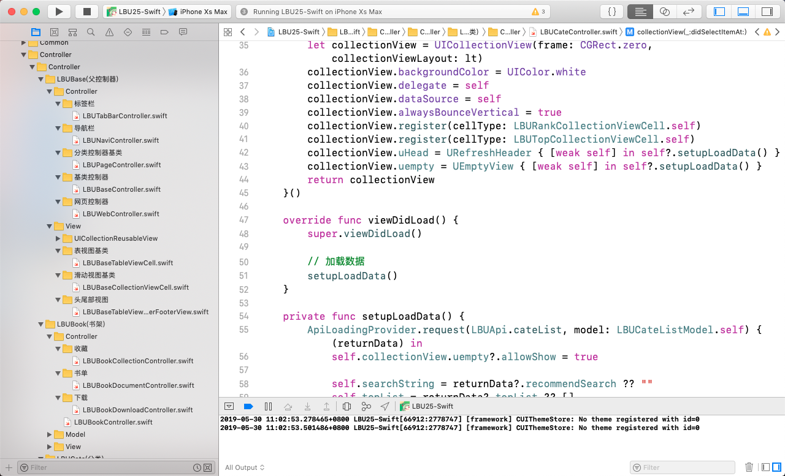

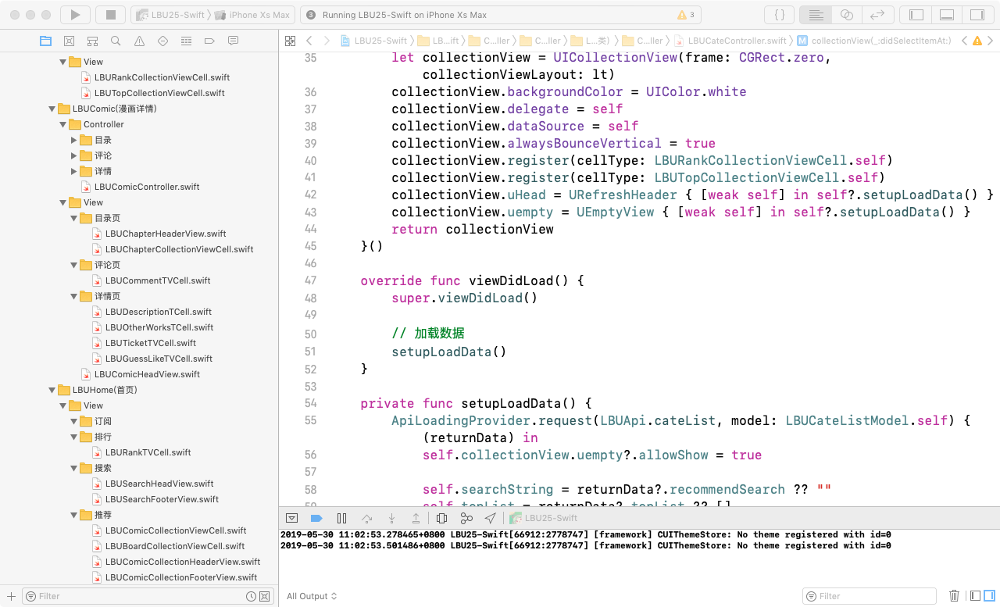

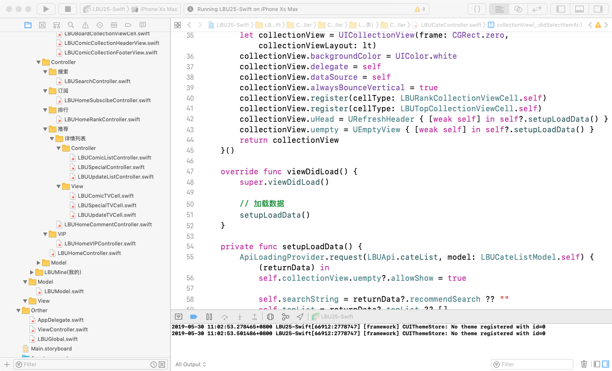

###### 1. 首页
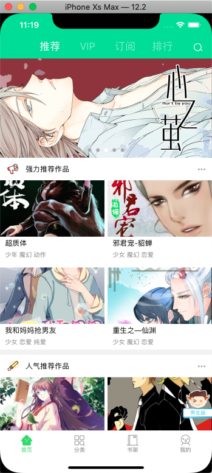

###### 2. 分类
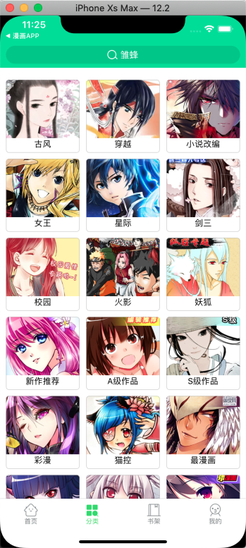

###### 3. 详情页
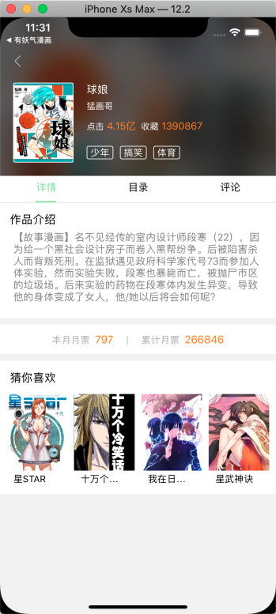

###### 4. 我的
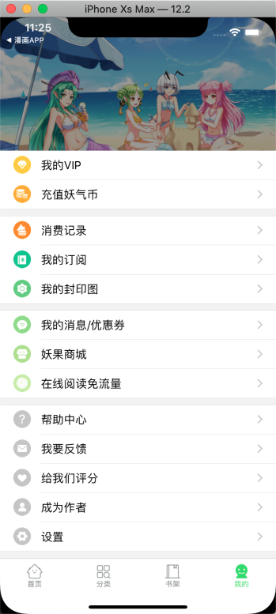

###### 5. 目录页
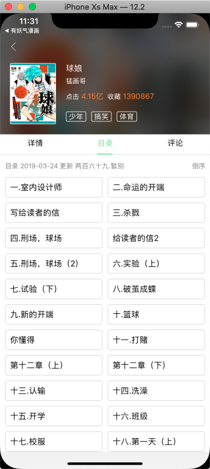

###### 6. 评论页
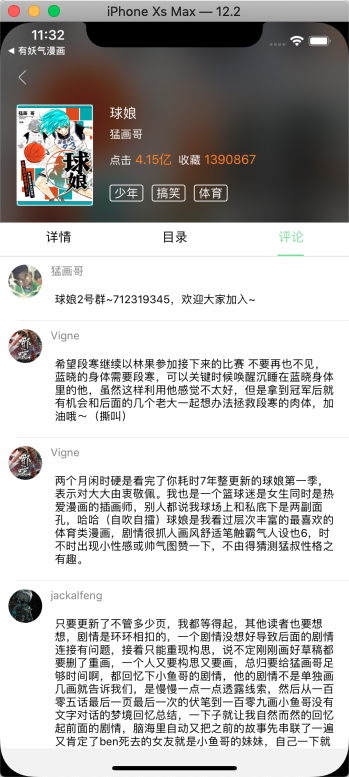

###### 7. 漫画观赏页
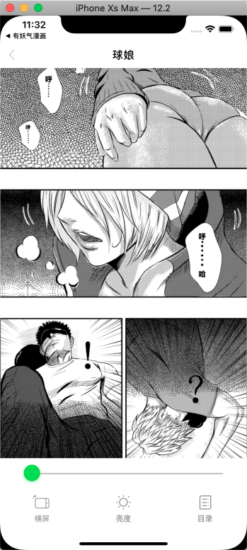

###### 8. 强制横竖屏展示
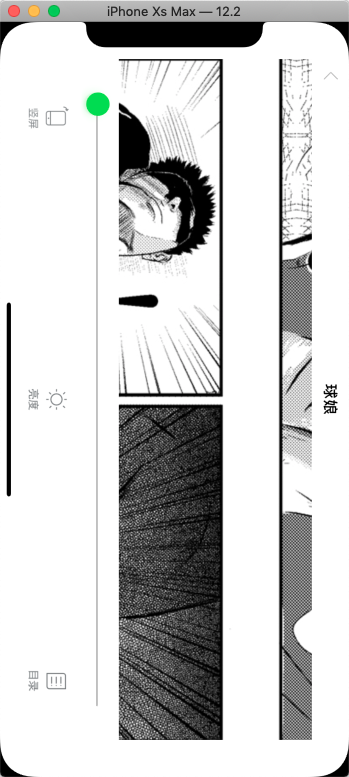
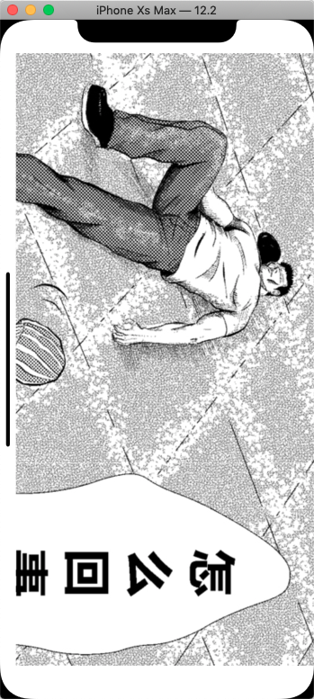

###### 9. VIP
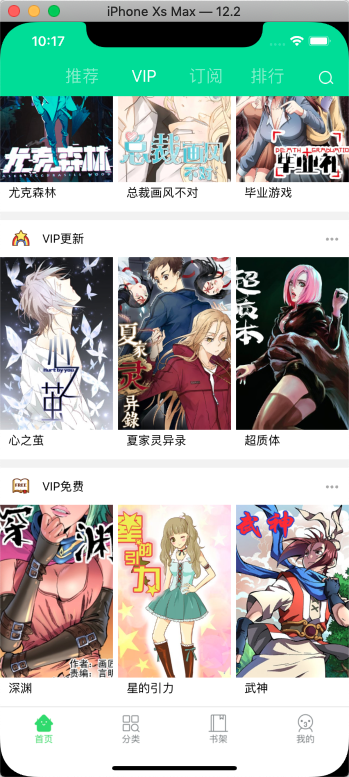

###### 10. 订阅
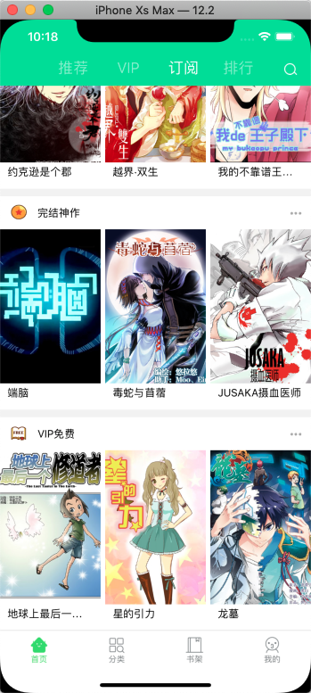

###### 11. 排行

###### 12. 排行
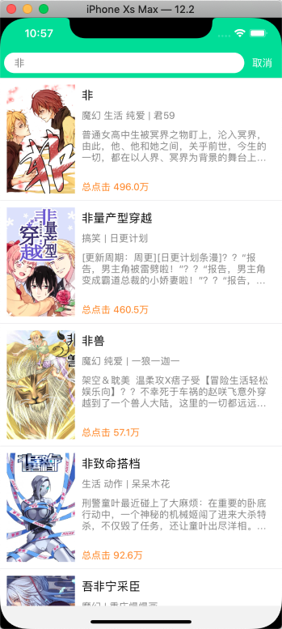

###### 13. 排行

#### 1️⃣小伙伴们请狠狠猛戳 Github[喜马拉雅项目-Swift5版本](https://github.com/lb2281075105/LBXMLYFM-Swift.git)

如有侵权,造成影响,请联系本人删除,谢谢
